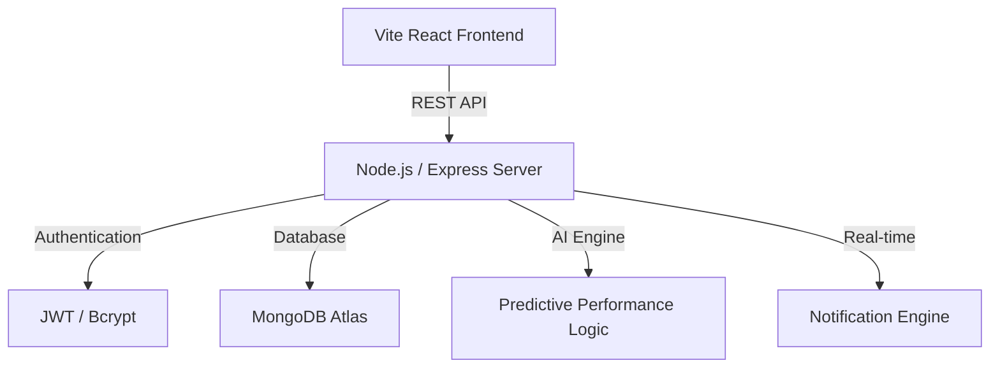

# 🚀 Rewardly: Next-Gen HRM & Employee Engagement Ecosystem

[](https://mongodb.com)
[](https://vitejs.dev)
[](https://opensource.org/licenses/ISC)
[](https://vercel.com)

**Rewardly** is a high-performance, enterprise-grade Human Resource Management platform that leverages gamification and AI-driven logic to transform workplace culture. Designed for modern teams, it bridges the gap between performance tracking and employee motivation.

---

## 🏗️ System Architecture



---

## 💎 Premium Features

### 🏆 Advanced Gamification Engine
*   **Dynamic Points Allocation**: Automatic rewards for attendance, milestone completion, and peer-to-peer recognition.
*   **Tier Progression**: sophisticated algorithm that promotes users through **Standard**, **Bronze**, **Silver**, and **Gold** ranks based on cumulative performance metrics.

### 🤖 Intelligent Productivity Audits
*   **AI-Driven Insights**: Monthly performance audits that analyze quality scores, teamwork, and punctuality.
*   **Career Roadmap**: Personalized recommendations for professional growth based on data-driven feedback.

### 📢 Peer-to-Peer Social Ecosystem
*   **Public Shoutouts**: A high-visibility feed for real-time employee recognition.
*   **Interactive Leaderboards**: Transparent, real-time rankings to foster healthy competition and excellence.

### 📊 Enterprise Analytics Dashboard
*   **Visual Data Streams**: Complex data visualization using Recharts to monitor team health and individual output.
*   **Managerial Insights**: High-level overview for administrators to identify top talent and areas for optimization.

---

## 🛡️ Technical Excellence

*   **Optimized Database**: Implemented MongoDB indexing and `.lean()` queries for sub-second data retrieval.
*   **Secure Auth**: Industry-standard JWT implementation with secure HTTP-only cookie patterns.
*   **Responsive Glassmorphism**: A stunning, modern UI/UX designed with a "Mobile-First" approach.
*   **Robust API Architecture**: Clean, modular controller-based backend for infinite scalability.

---

## 🚀 Deployment & Installation

### 1. Prerequisites
- **Node.js** v18+
- **MongoDB Atlas** Account
- **Vercel** & **Render** accounts for hosting

### 2. Local Setup
```bash
# Clone the repository
git clone https://github.com/VishalSudhaArul/Rewardly-MERN.git

# Initialize Backend
cd backend && npm install
# Initialize Frontend
cd ../frontend && npm install
```

### 3. Environment Variables
Create a `.env` in the `/backend` directory:
```env
PORT=5000
MONGO_URI=your_atlas_connection_string
JWT_SECRET=your_secure_jwt_secret
FRONTEND_URL=http://localhost:5173
```

---

## 🛣️ Roadmap
- [ ] **Slack/Teams Integration**: Automated shoutouts to company channels.
- [ ] **AI Chatbot**: 24/7 HR support assistant.
- [ ] **Custom Reward Store**: Direct integration with gift card APIs.
- [ ] **Mobile App**: Native iOS/Android experience.

---

## 📄 License
Distributed under the ISC License. See `LICENSE` for more information.

**Designed with ❤️ by Vishal Sudha Arul**
